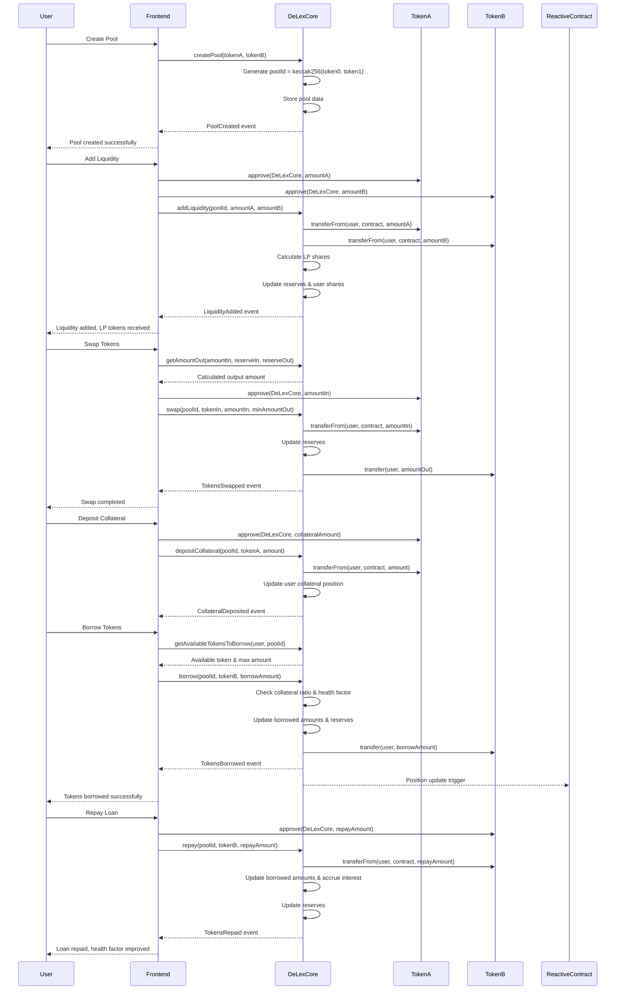
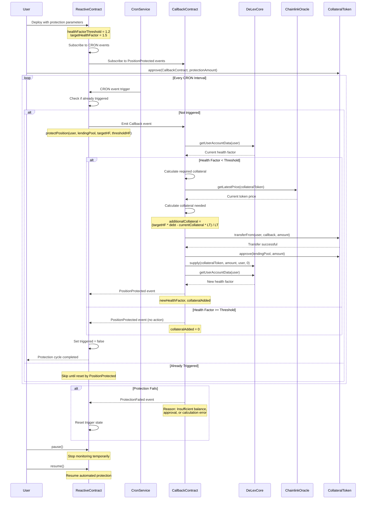

# Len-Ex Protocol - Decentralized Lending + Exchange Protocol

**Team: Bhaisaaab**

## Overview

Len-Ex Protocol is a unified DeFi platform that combines Automated Market Maker (AMM) functionality with lending and borrowing capabilities. Built on Ethereum Sepolia testnet, it enables users to swap tokens, provide liquidity, and participate in cross-token lending with automated liquidation protection powered by reactive smart contracts.

## 🚀 Live Deployment

- **Core Contract (Sepolia)**: [0x0Be9c90Ea6C387b974888dE1C21c6a0F96bC50C6](https://sepolia.etherscan.io/address/0x0Be9c90Ea6C387b974888dE1C21c6a0F96bC50C6)
- **Reactive Contract**: [Reactive Network Explorer](https://kopli.reactscan.net/address/0x49abe186a9b24f73e34ccae3d179299440c352ac/contract/0xb6de0ba0323d0d95a2f65218a9186e57eb171936?screen=transactions)
- **Frontend**: [Live Demo](https://len-ex.vercel.app/)

## 🌟 Key Features

### Core DeFi Functionality
- **Token Swapping**: AMM-based token exchange with 0.3% trading fees
- **Liquidity Provision**: Earn fees by providing liquidity to trading pairs
- **Cross-Token Lending**: Deposit one token as collateral, borrow another
- **Health Factor Monitoring**: Real-time position health tracking
- **Pool Analytics**: Comprehensive statistics and APY calculations

### Advanced Features
- **Reactive Liquidation Protection**: Automated position protection using Reactive Network
- **Multi-Pool Support**: Create and manage multiple token pairs
- **Faucet Integration**: Test token distribution for development
- **Real-time Updates**: Live pool statistics and user positions

## 🏗️ Architecture

### Main Protocol Sequence Diagram



### Liquidation Protection Sequence Diagram



## 📦 Installation & Setup

### Prerequisites
- Node.js v16+
- MetaMask or compatible Web3 wallet
- Sepolia ETH for transactions

### Local Development

```bash
# Clone the repository
git clone <repository-url>
cd len-ex-protocol

# Install dependencies
npm install

# Set up environment variables
cp .env.example .env
# Configure your environment variables

# Start development server
npm start
```

### Environment Variables

```bash
REACT_APP_NETWORK=sepolia
REACT_APP_DELEX_CORE_ADDRESS=0x0Be9c90Ea6C387b974888dE1C21c6a0F96bC50C6
REACT_APP_REACTIVE_CONTRACT_ADDRESS=<reactive-contract-address>
```

## 🎮 Usage Guide

### 1. Connect Wallet
- Install MetaMask
- Switch to Sepolia testnet
- Connect to the application

### 2. Get Test Tokens
- Use the faucet feature for test tokens
- Or get tokens from Sepolia faucets

### 3. Create or Select Pool
- Navigate to Pools page
- Create new pool or select existing one
- View pool statistics and liquidity

### 4. Swap Tokens
- Go to Swap interface
- Enter token addresses
- Set swap amount and execute

### 5. Provide Liquidity
- Access Liquidity interface
- Add tokens to pools
- Earn trading fees

### 6. Lending & Borrowing
- Navigate to Lending page
- Deposit collateral in one token
- Borrow different token from same pool
- Monitor health factor

### 7. Liquidation Protection Setup
- Deploy reactive contract with parameters
- Approve collateral token spending
- Set health factor thresholds
- Enable automated monitoring

## 🔧 Smart Contract Details

### Core Contract: DeLexCore.sol

**Key Functions:**
- `createPool(tokenA, tokenB)`: Create new trading pair
- `addLiquidity(poolId, amountA, amountB)`: Add liquidity to pool
- `removeLiquidity(poolId, shares)`: Remove liquidity from pool
- `swap(poolId, tokenIn, amountIn, minAmountOut)`: Execute token swap
- `depositCollateral(poolId, token, amount)`: Deposit lending collateral
- `borrow(poolId, token, amount)`: Borrow against collateral
- `repay(poolId, token, amount)`: Repay borrowed amount
- `withdrawCollateral(poolId, token, amount)`: Withdraw collateral

**Key Features:**
- Cross-token borrowing (deposit tokenA, borrow tokenB)
- Automatic interest accrual
- Health factor calculations
- Collateral factor: 75%
- Trading fee: 0.3%

### Reactive Contracts

**AaveLiquidationProtectionReactive.sol**: Monitors positions and triggers protection
**AaveDemoLiquidationProtectionCallback.sol**: Executes protection by adding collateral


### Test Scenarios
1. Create pool with test tokens
2. Add liquidity to new pool
3. Execute swaps with different amounts
4. Test lending with various collateral ratios
5. Monitor liquidation protection

## 🚨 Security Considerations

- Always verify token addresses before transactions
- Monitor health factors to avoid liquidation
- Understand cross-token borrowing constraints
- Use slippage protection for swaps
- Keep collateral ratios above 1.5 for safety

## 🛠️ Technical Stack

- **Frontend**: React, Tailwind CSS, Ethers.js
- **Smart Contracts**: Solidity, OpenZeppelin
- **Blockchain**: Ethereum Sepolia
- **Reactive Layer**: Reactive Network
- **Price Feeds**: Chainlink Oracles
- **Testing**: Foundry, React Testing Library

## 📊 Contract Interactions

### Pool Creation
```solidity
function createPool(address tokenA, address tokenB) 
    external returns (bytes32 poolId)
```

### Liquidity Operations
```solidity
function addLiquidity(bytes32 poolId, uint256 amountA, uint256 amountB) 
    external returns (uint256 shares)

function removeLiquidity(bytes32 poolId, uint256 shares) 
    external returns (uint256 amountA, uint256 amountB)
```

### Trading
```solidity
function swap(bytes32 poolId, address tokenIn, uint256 amountIn, uint256 minAmountOut) 
    external returns (uint256 amountOut)
```

### Lending
```solidity
function depositCollateral(bytes32 poolId, address token, uint256 amount) external
function borrow(bytes32 poolId, address token, uint256 amount) external
function repay(bytes32 poolId, address token, uint256 amount) external
```

## 🤝 Contributing

1. Fork the repository
2. Create feature branch
3. Commit changes
4. Submit pull request

## 📄 License

MIT License - see LICENSE file for details

## 🔗 Links

- **Core Contract**: [Sepolia Etherscan](https://sepolia.etherscan.io/address/0x0Be9c90Ea6C387b974888dE1C21c6a0F96bC50C6)
- **Reactive Contract**: [Reactive Network](https://kopli.reactscan.net/address/0x49abe186a9b24f73e34ccae3d179299440c352ac/contract/0xb6de0ba0323d0d95a2f65218a9186e57eb171936?screen=transactions)


**Built with ❤️ by Team Bhaisaaab**